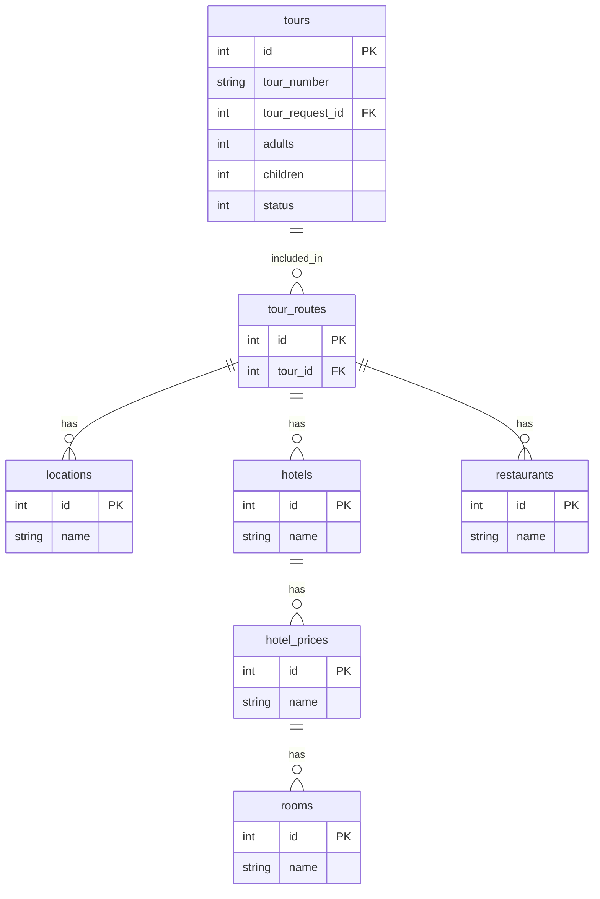

### Tour Management 

```mermaid

erDiagram
    tours {
        int id PK
        string tour_number
        int tour_request_id FK
        int adults
        int children
        int status
    }

    tour_routes{
        int id PK
        int tour_id FK
    }

    locations{
        int id PK
        string name
    }

    hotels{
        int id PK
        string name
    }

    hotel_prices{
        int id PK
        string name
    }

    rooms{
        int id PK
        string name
    }

    restaurants{
        int id PK
        string name
    }

    tours ||--o{ tour_routes : included_in
    tour_routes ||--o{ locations : has
    tour_routes ||--o{ hotels : has
    tour_routes ||--o{ restaurants : has

    hotels ||--o{ hotel_prices : has
    hotel_prices ||--o{ rooms : has

    
```